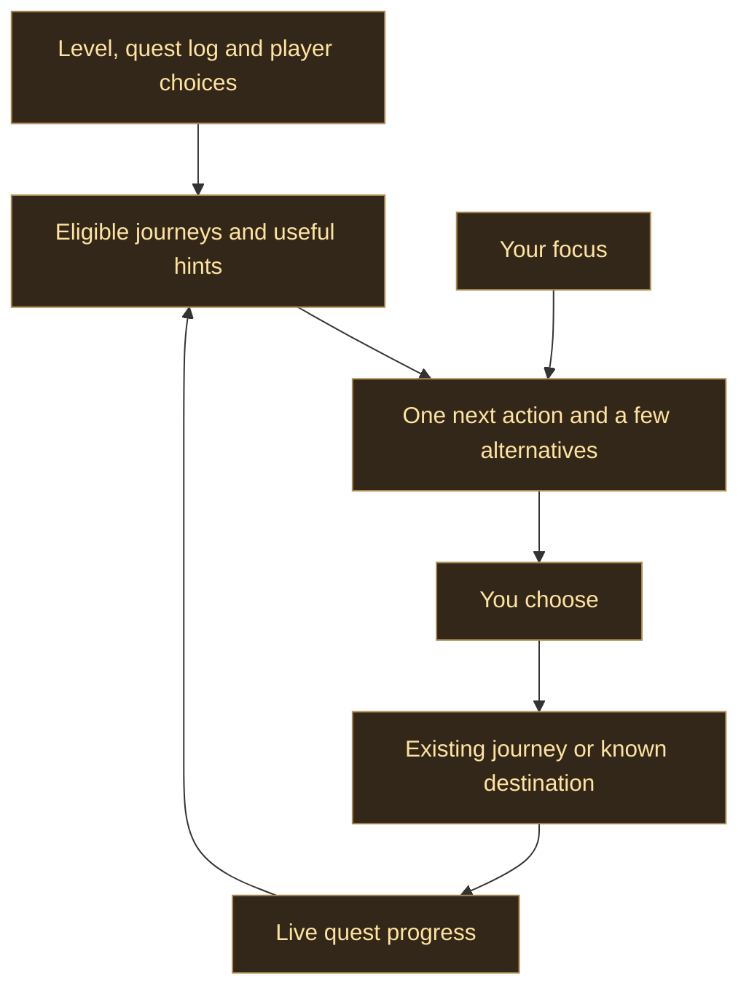

# Helping you choose your next adventure

The guide should help a player who has logged in, finished a quest or reached a city decide what to do next. It should offer a reason and a useful first action, while leaving room to wander.

## Next page

The first page brings the existing quest, class training and profession hints together. One suggestion leads, followed by up to three alternatives. Each says what to do and why. A bit of everything is the default focus; quests, training, professions and dungeons narrow the suggestions.

A chosen journey leads the balanced view, even when paused. Without a chosen journey, class training within a short local walk can precede the suggested route. Changing focus does not choose a journey, enable dungeon offers or replace a waypoint. Start, Resume and Show on Map use the existing guidance lifecycle. Text-only hints stay advice. An empty focus points to the journey and dungeon pages, rather than inventing a task.

Suggestions read the committed route and the hints the player still wants. A pending rebuild shows an updating message. Clicking a suggestion checks that it still exists and that its destination and current task match. Combat and Wanderer mode prevent navigation. City district changes refresh hints on the next frame, without another periodic scan or a quest-route rebuild.

## Next steps for the wider guide

1. **Context before leaving town.** Group useful errands by their proven location, show which fit the current trip, and distinguish learning a new profession from advancing one the character already has. Keep optional errands separate from quest route progress.
2. **Progression goals.** Let the player name a goal such as a zone story, class milestone or dungeon preparation. Explain the next proven prerequisite and retain the goal across travel and reloads. Build on the current journey and planned-dungeon state instead of another route system.
3. **Better choices for the time available.** Apply the existing session estimates to comparisons between journeys. Show an estimate only when both travel and required work are known, and never leave a newly picked-up quest without its planned return.
4. **Completion and crafting choices.** Bring useful actions from Legacy and SkillUp into the decision page through their public APIs. Preserve their ownership of objective progress and crafting recommendations.
5. **What happens after a milestone.** Offer a quiet explanation of the next available chapter, training opportunity or destination after a level or story ending. Keep unknown requirements explicit, and leave fixed walkthroughs, boss advice and loot selection to their existing sources.

Each step needs source-backed eligibility, a visible reason, reversible player choices and checks for missing companions, stale data, combat, reload and frame cost. No recommendation depends on a guessed location or on reading a companion's private tables.

## Client checks

- Open `/agf` on a character with no saved tab, then reload with another tab selected.
- Switch every focus. Check that the tracked journey and waypoint do not change until an action is pressed.
- Start an offered journey, stop it, then resume from Next. Repeat with Shortest Path disabled.
- Dismiss a hint or complete the leading task and check that the page updates without an old action remaining active.
- Walk between city districts, enter and leave combat, and check trainer destinations and profession hints.
- Check a focus with no suggestions, a text-only hint, Wanderer mode and a missing Questie source.

The repository's headless checks and generated previews cover the logic and layout. These client checks remain necessary before merging a player-visible change.
